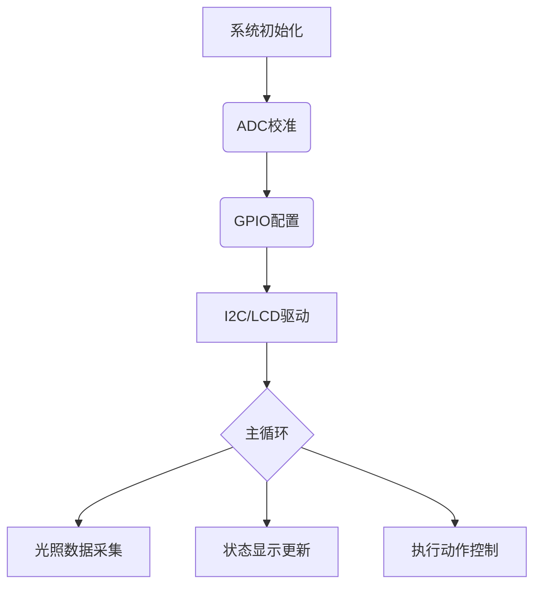

# Soil-light-detection-automatic-irrigation-system
## 项目概述
本系统基于STC8G1K08单片机设计，实现土壤环境光照强度的实时监测与显示，并通过模拟执行组件（SG90舵机）进行智能化灌溉控制。主要功能包括：
- 使用LCD1602显示屏实时显示土壤光照强度及系统运行状态
- 通过光敏电阻采集光照数据并转换为可读值
- 利用WS2812B灯珠动态指示设备工作状态（RGB编码）
- 提供标准下载接口用于程序烧录

---

## 硬件组件与连接方式

### 📺 LCD1602显示屏 (采用GPIO协议)
| 引脚 | 功能        |
|------|-------------|
| VCC   | 接MCU的3.3V电源（需注意电压匹配）          |
| GND   | 接地线                              |
| RS    | 数据/指令选择信号（高电平为数据模式）       |
| RW    | 读写控制，本项目使用单向写入模式故接地      |
| EN    | 启动信号，每帧数据传输必须先拉高再拉低       |
| D0-D7 | 平行8位数据接口（可选I2C或串口驱动）        |

**示例代码：**
```c
// 初始化LCD1602为8位GPIO模式
void lcd_init(void) {
    // 设置RS、EN和数据线引脚方向为输出

    // 写入初始化指令：
    LCD_RS = 0;           // 指令模式
    LCD_WR(0x38);         // 16×2显示，5×8点阵

    // 显示内容示例：光线强度 + 值（R/W）
    lcd_send_string("Light: ", 9);
}
```

---

### 🌦 光敏电阻 (单总线协议)
采用ADC口读取模拟电压值，对应光照强度范围为0-1023

| 引脚 | 功能        |
|------|-------------|
| VCC   | 接MCU 3.3V电源（注意：部分型号可能需分压处理）       |
| GND   | 接地线                              |
| ADC引脚 | 连接至STC8G1K08的ADC模块（如P3.6） |

**校准说明：**
- 需预先标定不同光照条件下的电压对应关系
- 建议在无光和强光环境下分别测量基准值

---

### 🌈 WS2812B灯珠 (专用协议驱动)
| 引脚 | 功能        |
|------|-------------|
| 数据线 | 连接至通用I/O口（如P3.5）          |

**颜色控制：**
```c
// 示例函数用于向WS2812发送RGB数据：
void ws2812_send_color(uint8_t r, uint8_t g, uint8_t b) {
    // 根据协议公式计算时序参数（略）

    // 发送顺序示例：高电平开始，低电平结束
    send_bits(r, 8);
    send_bits(g, 8);
    send_bits(b, 8);
}
```

---

### 📡 下载接口 (标准4针)
| 引脚 | 功能        |
|------|-------------|
| VCC   | 提供+5V工作电压（注意：部分STC单片机可容忍3.3V）       |
| RXD   | 串口接收端      |
| TXD   | 串口发送端      |
| GND   | 接地线        |

**烧录注意事项：**
- 使用USB转TTL模块连接时需注意电平转换
- 烧录前请确保单片机已复位（可通过额外按键实现）

---

### 🎡 SG90舵机 (PWM角度控制)
| 引脚 | 功能        |
|------|-------------|
| 信号线 | 连接至通用I/O口（如P3.4）          |

**控制逻辑：**
```c
// PWM输出示例代码：
void servo_set_angle(uint8_t angle) {
    // 计算占空比：% = (angle * 60/180 + 5%) * 20ms周期时间

    // 典型PWM公式（脉宽+高电平持续时间）：
    uint16_t pulse_width = (angle * 49) + 784;   // 角度转脉冲宽度的示例
    set_PWM(P3_4, pulse_width);                   // 假设set_PWM为通用函数接口

    // 发送PWM后需保持低电平一段时间（约5ms）完成一次转动指令
}
```

---

## 软件实现

### 开发环境配置
1. 新建Keil5工程，选择STC8G系列内核
2. 配置晶振频率为11.0592MHz或12MHz（根据硬件设置）
3. 引入标准库函数：
   - `#include <iic.h>`         // I2C协议支持
   - `#include <stdio.h>`       // 标准输入输出
   - `#include "delay.c"`        // 延时模块（需自行编写）

### 主程序逻辑框架



---

## 系统烧录流程

1. 使用`stc-isp.exe`连接下载口
2. 选择正确的晶振频率（如11.0592MHz）
3. 设置烧录参数：
   - 下载地址：0x8000起始位置
   - 校验方式：自动校验HEX文件

4. 按如下步骤操作：
   - 打开目标文件（*.hex）
   - 点击“下载”按钮等待连接建立
   - 在烧录过程中注意不要复位单片机

---

## 调试注意事项

1. 光敏电阻数据波动问题解决方案：
   - 增加低通滤波算法处理原始ADC值
   - 使用电容进行硬件平滑（如0.1μF旁路）

2. WS2812B闪烁解决方法：
   - 检查时序参数计算是否正确
   - 降低PWM输出频率至约800kHz

---

## 版本记录

| 版本号 | 更新时间     | 主要修改内容 |
|--------|--------------|-------------|
| v1.0   | 2025-06-15    | 初始设计文档 |


程序会在下一次更新中加入
